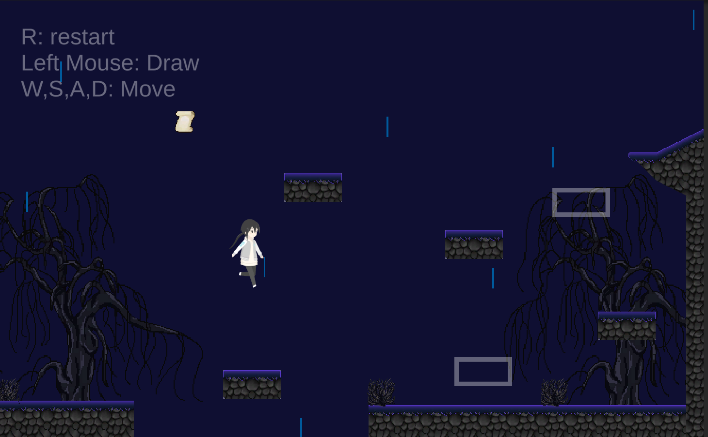

# DrawingPlatformer
## A platformer game where players draw paths to navigate and complete levels.
The Platformer game where you use drawing mechanics to complete levels. Navigate through various challenges by drawing paths, platforms, and solutions directly onto the game screen. Use your mouse or stylus to draw paths and platforms to guide your character through levels.
## Source folder
Most of my code is stored in [Scripts]() folder

## Screenshots

